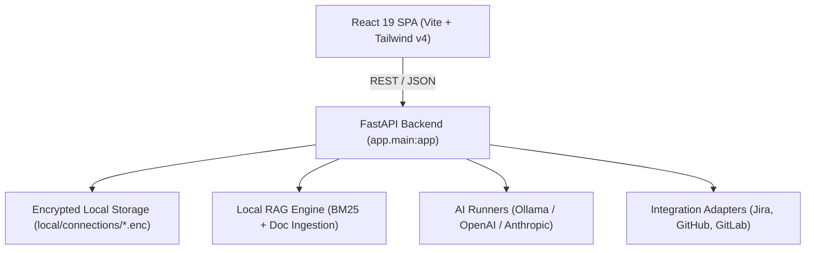

# Code Documentation

Technical specification and architectural guide for **PMQA Copilot**.

---

## 1. Architecture Overview

PMQA Copilot is structured as a decoupled client-server application optimized for local or containerized execution:

---

## 2. Backend Modules (`backend/app/`)

### Core & Storage (`app/core/`)
- [`app/core/settings.py`](file:///c:/Dev/FCV/qa_project_mgmt/backend/app/core/settings.py):
  Central environment configuration (`AppSettings` inheriting `pydantic_settings.BaseSettings`). Handles directories, CORS origins, and port bindings.
- [`app/core/storage.py`](file:///c:/Dev/FCV/qa_project_mgmt/backend/app/core/storage.py):
  Manages symmetric Fernet encryption for secrets. Uses OS `keyring` as primary entropy source, falling back to machine UUID derivation or `PMQA_SECRET_KEY`.
- [`app/core/integration_config.py`](file:///c:/Dev/FCV/qa_project_mgmt/backend/app/core/integration_config.py):
  Abstracts reading and writing connection states into `local/connections/{service}.enc`.

### Integrations Layer (`app/integrations/`)
- [`app/integrations/base.py`](file:///c:/Dev/FCV/qa_project_mgmt/backend/app/integrations/base.py):
  Base protocol `IntegrationAdapter` requiring:
  - `authenticate()` / `disconnect()` / `test_connection()`
  - `get_capabilities()`
  - `get_projects()` / `get_issues()` / `get_user()`
- [`app/integrations/jira/`](file:///c:/Dev/FCV/qa_project_mgmt/backend/app/integrations/jira/):
  Implementation supporting both OAuth 2.0 (Atlassian 3LO token exchange & refresh flow) and Personal Access Token (PAT) authentication.
- [`app/integrations/github/`](file:///c:/Dev/FCV/qa_project_mgmt/backend/app/integrations/github/):
  GitHub REST adapter supporting PAT, repository enumeration, and issue queries.
- [`app/integrations/gitlab/`](file:///c:/Dev/FCV/qa_project_mgmt/backend/app/integrations/gitlab/):
  GitLab REST adapter supporting Personal/Project Access Tokens.
- [`app/integrations/registry.py`](file:///c:/Dev/FCV/qa_project_mgmt/backend/app/integrations/registry.py):
  Singleton registry mapping provider keys (`jira`, `github`, `gitlab`) to active adapter instances.

### Context & RAG Engine (`app/context/`)
- [`app/context/knowledge.py`](file:///c:/Dev/FCV/qa_project_mgmt/backend/app/context/knowledge.py):
  Handles document ingestion for `.pdf` (via `pypdf`), `.docx` (via `python-docx`), `.txt`, and `.md`. Splits text into semantically sized chunks.
- [`app/context/retrieval.py`](file:///c:/Dev/FCV/qa_project_mgmt/backend/app/context/retrieval.py):
  Implements localized BM25 probabilistic ranking via `rank-bm25`. Scores and returns top-$k$ relevant text passages with document source metadata.
- [`app/context/service.py`](file:///c:/Dev/FCV/qa_project_mgmt/backend/app/context/service.py):
  Orchestrates knowledge indexing, document deletion, and context assembly for AI prompt injection.

### AI Engine (`app/ai/`)
- [`app/ai/runner.py`](file:///c:/Dev/FCV/qa_project_mgmt/backend/app/ai/runner.py):
  Multi-provider dispatcher for:
  - **Ollama**: Local asynchronous HTTP requests to `/api/generate`.
  - **OpenAI**: Cloud completion using OpenAI API standard endpoints.
  - **Anthropic**: Cloud completion using Claude API endpoints.
- [`app/ai/templates.py`](file:///c:/Dev/FCV/qa_project_mgmt/backend/app/ai/templates.py):
  Default system prompts and task definitions (Daily Standup, PRD Review, Change Impact, QA Test Matrix). Bootstraps customizable Markdown templates into `local/ai/prompts/`.
- [`app/ai/logging.py`](file:///c:/Dev/FCV/qa_project_mgmt/backend/app/ai/logging.py):
  Appends execution records (prompts, completion time, tokens, latency) to `local/ai/logs/` for local auditability.

### API Endpoints (`app/api/`)
- [`app/api/settings.py`](file:///c:/Dev/FCV/qa_project_mgmt/backend/app/api/settings.py):
  - `GET /api/health` -> Service heartbeat.
  - `GET /api/settings`, `POST /api/settings` -> Application display settings, active AI provider/model.
- [`app/api/integrations.py`](file:///c:/Dev/FCV/qa_project_mgmt/backend/app/api/integrations.py):
  - `GET /api/integrations` -> List status of all adapters.
  - `POST /api/integrations/{name}/connect` -> Save credentials / authenticate.
  - `POST /api/integrations/{name}/disconnect` -> Purge encrypted credentials.
  - `GET /api/integrations/{name}/test` -> Perform live ping.
  - `GET /api/integrations/jira/callback` -> OAuth 2.0 authorization redirect receiver.
- [`app/api/knowledge.py`](file:///c:/Dev/FCV/qa_project_mgmt/backend/app/api/knowledge.py):
  - `GET /api/knowledge/documents` -> List uploaded documents.
  - `POST /api/knowledge/upload` -> Multipart upload for parsing & indexing.
  - `DELETE /api/knowledge/documents/{doc_id}` -> Remove document and purge index.
- [`app/api/features.py`](file:///c:/Dev/FCV/qa_project_mgmt/backend/app/api/features.py):
  - `POST /api/features/standup` -> Generate daily standup report.
  - `POST /api/features/ask-product` -> Grounded RAG query answering.
  - `POST /api/features/prd-checker` -> PRD structural audit.
  - `POST /api/features/qa` -> QA test cases and risk analysis generation.

---

## 3. Frontend Architecture (`frontend/src/`)

### Design System & Layout
- **Tailwind CSS v4**: Theme defined in `src/index.css` with sleek dark background (`#0b0f19`), slate panels (`#1e293b`), and vibrant emerald/cyan accents.
- **Root Layout (`src/components/AppLayout.tsx`)**: Responsive sidebar navigation with connection badges, section collapsibles, and top app bar.

### Pages
- [`src/pages/DashboardPage.tsx`](file:///c:/Dev/FCV/qa_project_mgmt/frontend/src/pages/DashboardPage.tsx): System status, active provider indicator, and quick launch pads.
- [`src/pages/StandupPage.tsx`](file:///c:/Dev/FCV/qa_project_mgmt/frontend/src/pages/StandupPage.tsx): Standup generator with editable tasks, blockers, and output copying.
- [`src/pages/PrdCheckerPage.tsx`](file:///c:/Dev/FCV/qa_project_mgmt/frontend/src/pages/PrdCheckerPage.tsx): Markdown PRD input with rule-based evaluation.
- [`src/pages/ChangeImpactPage.tsx`](file:///c:/Dev/FCV/qa_project_mgmt/frontend/src/pages/ChangeImpactPage.tsx): Impact analysis across architecture and test suites.
- [`src/pages/qa/QaFeaturePage.tsx`](file:///c:/Dev/FCV/qa_project_mgmt/frontend/src/pages/qa/QaFeaturePage.tsx): QA hub for regression, API testing checklists, and triage.
- [`src/pages/KnowledgePage.tsx`](file:///c:/Dev/FCV/qa_project_mgmt/frontend/src/pages/KnowledgePage.tsx): File upload dropzone, document list, and index manager.
- [`src/pages/AskProductPage.tsx`](file:///c:/Dev/FCV/qa_project_mgmt/frontend/src/pages/AskProductPage.tsx): Conversational chat interface grounded in the knowledge base.
- [`src/pages/IntegrationsPage.tsx`](file:///c:/Dev/FCV/qa_project_mgmt/frontend/src/pages/IntegrationsPage.tsx): Setup cards for Jira (OAuth/PAT), GitHub (PAT), and GitLab.
- [`src/pages/SettingsPage.tsx`](file:///c:/Dev/FCV/qa_project_mgmt/frontend/src/pages/SettingsPage.tsx): AI provider switcher, Ollama base URL, API keys, and custom preferences.

### API Client (`src/api/client.ts`)
- Lightweight native `fetch` wrapper with typed interfaces in `src/types.ts`.
- Handles base URL fallback (`http://127.0.0.1:8000` or relative in production Docker).
