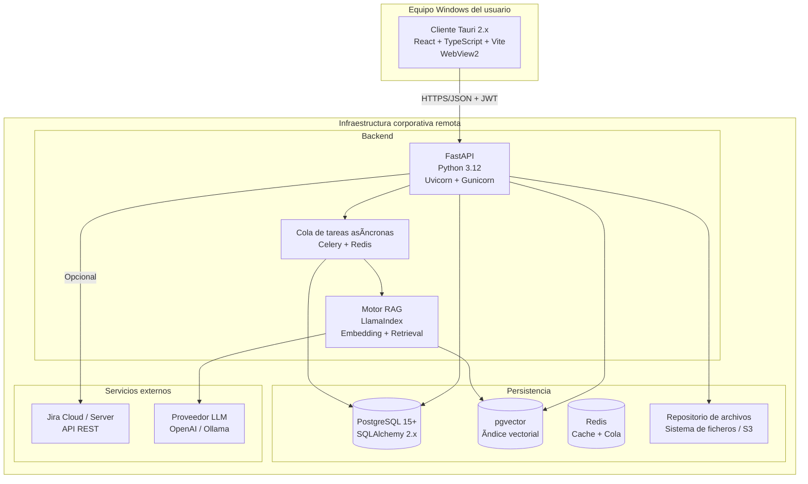
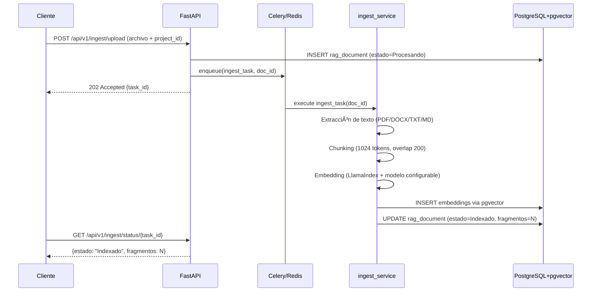
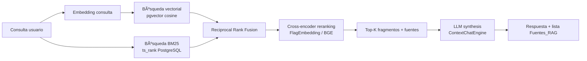
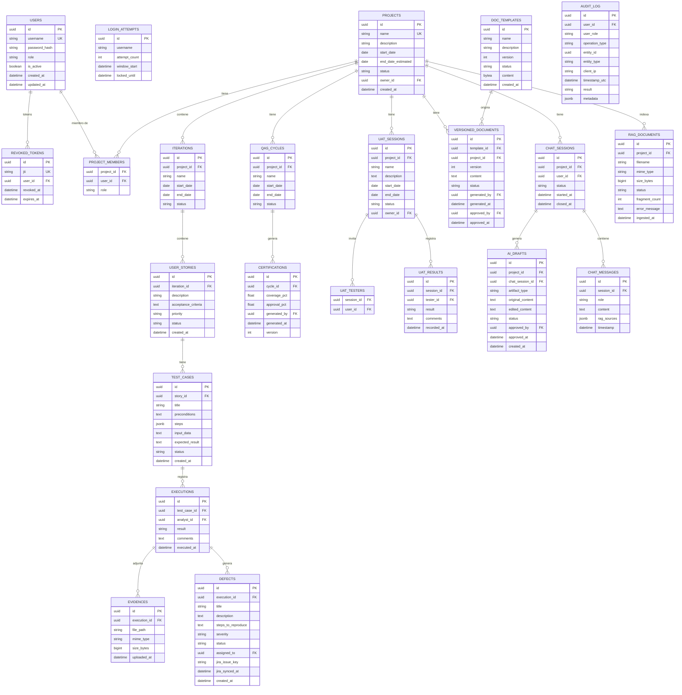

# Design Document

## Overview

**QA Project Mgmt** es una aplicación corporativa de escritorio para Windows que centraliza la gestión integral del ciclo de calidad de software: planificación de proyectos, ejecución de pruebas QA/QaS, sesiones de aceptación UAT, generación documental asistida por IA y trazabilidad de auditoría. La aplicación se distribuye como ejecutable nativo (.msi/.exe) mediante Tauri 2.x; el frontend React/TypeScript se ejecuta dentro del WebView del sistema operativo y se comunica exclusivamente con un backend FastAPI remoto a través de HTTPS/JSON. Ningún componente del backend ni la base de datos se instala en el equipo del usuario final.

### Objetivos de diseño

| Objetivo | Decisión arquitectónica |
|---|---|
| Cliente ligero sin dependencias de runtime | Tauri 2.x + WebView2 (incluido en Windows 10/11) |
| Lógica de negocio y autorización 100 % en servidor | FastAPI + JWT + RBAC en el backend |
| IA contextualizada por proyecto | LlamaIndex + pgvector (búsqueda híbrida densa + BM25) |
| Trazabilidad inmutable | Tabla `audit_log` append-only + políticas de fila en PostgreSQL |
| Evolución hacia cliente web sin reescritura | API REST stateless, contratos OpenAPI 3.0 |
| Seguridad corporativa | TLS 1.2+, bcrypt, rate limiting, encabezados de seguridad |

---

## Architecture

### Diagrama de componentes



### Principios de comunicación

- El Cliente **nunca** se conecta directamente a PostgreSQL, Redis ni al Motor RAG.
- Toda comunicación Cliente ↔ Backend usa HTTPS/JSON con JWT en el encabezado `Authorization: Bearer <token>`.
- La URL del backend se lee desde `app-config.json` (editable por el Administrador de TI, fuera del ejecutable compilado).
- Las tareas de larga duración (ingesta RAG, generación XLSX masiva) se delegan a Celery; el Cliente consulta el estado mediante un endpoint de tarea.

---

## Components and Interfaces

### 2.1 Cliente Tauri

| Módulo frontend | Responsabilidad |
|---|---|
| `AuthModule` | Formulario de login, almacenamiento JWT en memoria, refresco / caducidad |
| `ProjectModule` | CRUD proyectos, iteraciones, historias de usuario |
| `QAModule` | Casos de prueba, ejecuciones, evidencias, defectos, certificaciones |
| `UATModule` | Sesiones UAT, registro de resultados, resumen |
| `DocumentModule` | Plantillas, generación y aprobación de documentos versionados |
| `ChatModule` | Sesiones de chat con el Motor RAG, visualización de fuentes |
| `AIReviewModule` | Revisión y aprobación de borradores generados por IA |
| `IngestModule` | Carga de documentos al índice RAG, consulta de estado de tarea |
| `ImportExportModule` | Carga/descarga de archivos XLSX |
| `AuditModule` | Consulta del registro de auditoría (solo Administrador) |
| `AdminModule` | Gestión de usuarios y roles |

**Estado global:** Zustand con slices por módulo. El JWT se almacena exclusivamente en el store de Zustand (memoria de proceso); nunca en `localStorage`, cookies ni registro de Windows.

**Formularios:** React Hook Form + Zod para validación declarativa en cliente (complementa la validación Pydantic del servidor).

**HTTP Client:** `axios` con interceptor que adjunta el JWT, detecta 401 y redirige a login, y aplica reintentos exponenciales para 503.

### 2.2 Backend FastAPI

```
app/
├── main.py                  # Creación de la app FastAPI, middleware, CORS
├── core/
│   ├── config.py            # Settings (Pydantic BaseSettings, variables de entorno)
│   ├── security.py          # JWT encode/decode, bcrypt, lista de revocación
│   ├── dependencies.py      # get_current_user, require_role, get_db
│   └── rate_limiter.py      # Slowapi integration
├── db/
│   ├── base.py              # SQLAlchemy Base + engine + session factory
│   └── migrations/          # Alembic versions
├── models/                  # SQLAlchemy ORM models (uno por entidad)
├── schemas/                 # Pydantic schemas (Request / Response por entidad)
├── routers/
│   ├── auth.py
│   ├── users.py
│   ├── projects.py
│   ├── iterations.py
│   ├── stories.py
│   ├── test_cases.py
│   ├── executions.py
│   ├── evidences.py
│   ├── defects.py
│   ├── certifications.py
│   ├── uat_sessions.py
│   ├── documents.py
│   ├── chat.py
│   ├── ingest.py
│   ├── import_export.py
│   ├── audit.py
│   └── jira.py
├── services/
│   ├── auth_service.py
│   ├── project_service.py
│   ├── qa_service.py
│   ├── uat_service.py
│   ├── document_service.py
│   ├── rag_service.py       # Orquesta LlamaIndex
│   ├── ingest_service.py    # Pipeline de ingesta
│   ├── export_service.py    # Generación XLSX (openpyxl)
│   ├── import_service.py    # Validación e importación XLSX
│   ├── audit_service.py
│   └── jira_service.py
├── tasks/
│   ├── celery_app.py
│   ├── ingest_tasks.py
│   └── export_tasks.py
└── rag/
    ├── pipeline.py          # Pipeline LlamaIndex: chunk → embed → store
    ├── retriever.py         # Recuperación híbrida densa + BM25 + reranking
    └── chat_engine.py       # ContextChatEngine con historial de sesión
```

### 2.3 Motor RAG — Pipeline de ingesta y recuperación

#### Pipeline de ingesta (asíncrono, via Celery)



#### Pipeline de recuperación (híbrido)



**Decisión de diseño (ADR-004):** Se usa búsqueda híbrida densa+BM25 en lugar de solo vectorial porque los documentos corporativos contienen terminología técnica y números de referencia que la búsqueda semántica pura no recupera con precisión. El RRF combina ambas listas sin necesitar pesos calibrados manualmente.

---

## Data Models

### Diagrama entidad-relación (principales)



### Notas de diseño del modelo de datos

- **`steps` en `TEST_CASES`:** tipo `JSONB` con estructura `[{"order": 1, "description": "...", "expected": "..."}]`, máximo 100 elementos, validado por constraint `CHECK (jsonb_array_length(steps) <= 100)`.
- **`AUDIT_LOG`:** sin restricciones `ON DELETE CASCADE`; índices en `(timestamp_utc DESC)`, `(user_id)`, `(entity_type, entity_id)`, `(operation_type)`. La columna `metadata` almacena estado anterior/nuevo en formato JSON.
- **`REVOKED_TOKENS`:** job de limpieza Celery Beat que elimina tokens cuya `expires_at < NOW()` (solo tokens ya expirados; no modifica el log de auditoría).
- **`RAG_DOCUMENTS`:** el campo `fragment_count` se actualiza al finalizar la ingesta; en estado `Error_Ingesta` se preserva el `error_message` técnico.
- **`VERSIONED_DOCUMENTS.content`:** texto estructurado (Markdown o HTML limpio). Los binarios `.docx` se generan al momento de descarga, no se almacenan.
- **`AI_DRAFTS`:** `original_content` es inmutable (contenido del LLM); `edited_content` recoge las modificaciones del Líder_QA. Ambos campos se preservan para trazabilidad.

---

## API Design

Prefijo global: `/api/v1`

### Módulo 1: Autenticación

| Método | Ruta | Rol requerido | Descripción |
|---|---|---|---|
| POST | `/auth/login` | — | Autenticación; devuelve JWT |
| POST | `/auth/logout` | Autenticado | Revoca el JWT activo |
| POST | `/auth/register` | Administrador | Crea usuario con rol |
| PUT | `/auth/users/{id}/password` | Administrador / propio | Cambio de contraseña |

### Módulo 2: Gestión de Roles y Usuarios

| Método | Ruta | Rol requerido | Descripción |
|---|---|---|---|
| GET | `/users` | Administrador | Lista usuarios |
| GET | `/users/{id}` | Administrador | Detalle usuario |
| PUT | `/users/{id}/role` | Administrador | Asigna / cambia rol |
| DELETE | `/users/{id}` | Administrador | Desactiva usuario |

### Módulo 3: Proyectos, Iteraciones e Historias

| Método | Ruta | Rol requerido | Descripción |
|---|---|---|---|
| GET | `/projects` | Todos | Lista proyectos asignados al usuario |
| POST | `/projects` | Líder_QA | Crea proyecto |
| GET | `/projects/{id}` | Asignado | Detalle proyecto |
| PUT | `/projects/{id}` | Líder_QA | Edita proyecto |
| PATCH | `/projects/{id}/status` | Líder_QA | Cambia estado |
| POST | `/projects/{id}/iterations` | Líder_QA | Crea iteración |
| GET | `/projects/{id}/iterations` | Asignado | Lista iteraciones |
| PUT | `/iterations/{id}` | Líder_QA | Edita iteración |
| POST | `/iterations/{id}/stories` | Líder_QA, Analista_QA | Crea historia |
| GET | `/iterations/{id}/stories` | Asignado | Lista historias |
| PUT | `/stories/{id}` | Líder_QA, Analista_QA | Edita historia |

### Módulo 4: QA/QaS

| Método | Ruta | Rol requerido | Descripción |
|---|---|---|---|
| POST | `/stories/{id}/test-cases` | Líder_QA | Crea caso de prueba |
| GET | `/stories/{id}/test-cases` | Asignado | Lista casos |
| PUT | `/test-cases/{id}` | Líder_QA | Edita caso |
| PATCH | `/test-cases/{id}/status` | Líder_QA | Cambia estado (Borrador→Aprobado→Obsoleto) |
| POST | `/test-cases/{id}/executions` | Analista_QA | Registra ejecución |
| GET | `/test-cases/{id}/executions` | Asignado | Lista ejecuciones |
| POST | `/executions/{id}/evidences` | Analista_QA | Adjunta evidencia (multipart) |
| GET | `/executions/{id}/evidences` | Asignado | Lista evidencias |
| POST | `/executions/{id}/defects` | Analista_QA | Registra defecto (solo si result=Fallido) |
| GET | `/executions/{id}/defects` | Asignado | Lista defectos |
| PATCH | `/defects/{id}/status` | Líder_QA, Analista_QA | Cambia estado defecto |
| POST | `/projects/{id}/qas-cycles` | Líder_QA | Crea ciclo QaS |
| POST | `/qas-cycles/{id}/certifications` | Líder_QA | Genera certificación |
| GET | `/qas-cycles/{id}/certifications` | Asignado | Lista certificaciones |

### Módulo 5: Sesiones UAT

| Método | Ruta | Rol requerido | Descripción |
|---|---|---|---|
| POST | `/projects/{id}/uat-sessions` | Líder_QA | Crea sesión UAT |
| GET | `/projects/{id}/uat-sessions` | Asignado | Lista sesiones |
| GET | `/uat-sessions/{id}` | Asignado | Detalle |
| POST | `/uat-sessions/{id}/results` | UAT_Tester (invitado) | Registra resultado |
| GET | `/uat-sessions/{id}/summary` | Líder_QA | Resumen de participación |

### Módulo 6: Generación Documental

| Método | Ruta | Rol requerido | Descripción |
|---|---|---|---|
| GET | `/doc-templates` | Autenticado | Lista plantillas activas |
| POST | `/doc-templates` | Administrador | Crea plantilla |
| PATCH | `/doc-templates/{id}/status` | Administrador | Activa / Obsoleta |
| POST | `/projects/{id}/documents` | Líder_QA | Genera documento versionado |
| GET | `/projects/{id}/documents` | Asignado | Lista documentos |
| GET | `/documents/{id}` | Asignado | Detalle + historial de versiones |
| PATCH | `/documents/{id}/approve` | Líder_QA | Aprueba documento |
| GET | `/documents/{id}/download` | Asignado | Descarga (HTML o .docx) |

### Módulo 7: Motor RAG — Chat e Ingesta

| Método | Ruta | Rol requerido | Descripción |
|---|---|---|---|
| POST | `/projects/{id}/chat-sessions` | Líder_QA, Analista_QA | Inicia sesión de chat |
| GET | `/chat-sessions/{id}/messages` | Propietario | Historial |
| POST | `/chat-sessions/{id}/messages` | Propietario | Envía mensaje |
| PATCH | `/chat-sessions/{id}/close` | Propietario | Cierra sesión |
| POST | `/projects/{id}/ingest` | Administrador, Líder_QA | Sube documento para ingesta |
| GET | `/ingest/status/{task_id}` | Administrador, Líder_QA | Estado de tarea |
| GET | `/projects/{id}/rag-documents` | Asignado | Lista documentos indexados |
| DELETE | `/rag-documents/{id}` | Administrador, Líder_QA | Elimina del índice |

### Módulo 8: Revisión de Borradores IA

| Método | Ruta | Rol requerido | Descripción |
|---|---|---|---|
| GET | `/projects/{id}/ai-drafts` | Líder_QA | Lista borradores pendientes |
| GET | `/ai-drafts/{id}` | Líder_QA | Detalle borrador |
| PATCH | `/ai-drafts/{id}` | Líder_QA | Edita borrador |
| PATCH | `/ai-drafts/{id}/approve` | Líder_QA | Aprueba borrador |

### Módulo 9: Importación / Exportación

| Método | Ruta | Rol requerido | Descripción |
|---|---|---|---|
| GET | `/projects/{id}/export` | Líder_QA | Exporta XLSX (query param: `entity=test_cases\|stories\|defects\|executions`) |
| POST | `/projects/{id}/import` | Líder_QA | Importa XLSX (multipart, query param: `entity`) |

### Módulo 10: Auditoría

| Método | Ruta | Rol requerido | Descripción |
|---|---|---|---|
| GET | `/audit-log` | Administrador | Consulta filtrada y paginada |

### Módulo 11: Integración Jira

| Método | Ruta | Rol requerido | Descripción |
|---|---|---|---|
| POST | `/projects/{id}/jira-config` | Administrador | Configura credenciales Jira |
| POST | `/defects/{id}/sync-jira` | Líder_QA | Sincroniza defecto con Jira |
| PATCH | `/defects/{id}/sync-jira` | Líder_QA | Actualiza estado en Jira |

---

## Architecture Decisions

### ADR-001: Tauri 2.x como cliente sin backend embebido

**Contexto:** El requisito 12 exige un ejecutable Windows que no instale Python ni .NET.  
**Decisión:** La aplicación Tauri encapsula únicamente el frontend React/TypeScript. El backend FastAPI se despliega en infraestructura remota. La URL del backend se configura externamente.  
**Consecuencias:** El cliente no tiene capacidad offline. Si el backend no está disponible, el cliente muestra un error descriptivo (Req. 12.6). Se elimina la complejidad de empaquetar el runtime Python en el instalador.

### ADR-002: JWT stateless + lista de revocación en Redis

**Contexto:** El Req. 1.7 exige invalidar el JWT al hacer logout. El Req. 2.4 exige invalidar todos los JWT de un usuario al cambiar su rol. JWT stateless no admite revocación nativa.  
**Decisión:** Se mantiene una lista de JTI (JWT ID) revocados en Redis con TTL igual al tiempo de expiración del token. En cada petición protegida se comprueba si el JTI está en la lista antes de procesar la solicitud.  
**Alternativa descartada:** Sesiones de servidor (stateful) — incompatible con Req. 15.4 (stateless para futura web).

### ADR-003: Auditoría append-only con políticas de fila de PostgreSQL

**Contexto:** El Req. 11.3 prohíbe la modificación o eliminación de registros de auditoría.  
**Decisión:** La tabla `audit_log` no tiene claves foráneas con `ON DELETE CASCADE`. Se crea un rol PostgreSQL de solo-inserción (`audit_writer`) que el backend usa exclusivamente para escribir en `audit_log`. Se aplica una Row Security Policy que deniega UPDATE y DELETE a todos los roles excepto el superusuario de mantenimiento.  
**Consecuencia:** Los borrados en otras tablas no propagan a `audit_log`. El historial se conserva incluso si se elimina una entidad.

### ADR-004: Búsqueda híbrida densa + BM25 con Reciprocal Rank Fusion

**Contexto:** Los documentos corporativos combinan texto narrativo y terminología técnica precisa (códigos, identificadores, numeraciones). La búsqueda puramente semántica pierde precisión en términos exactos; BM25 solo no captura sinónimos semánticos.  
**Decisión:** Recuperación híbrida: (1) búsqueda vectorial `<=>` cosine en pgvector; (2) búsqueda full-text `ts_rank` nativa de PostgreSQL. Las dos listas se fusionan con RRF y se rerankean con un cross-encoder ligero (BGE-reranker-v2-m3 vía sentence-transformers).  
**Umbral de similitud:** configurable por proyecto, valor por defecto 0.75 (score RRF normalizado).

### ADR-005: Celery + Redis para tareas asíncronas

**Contexto:** La ingesta de documentos RAG (hasta 50 MB, chunking + embedding) y la exportación XLSX masiva (hasta 5000 registros) no caben en el tiempo de respuesta HTTP esperado.  
**Decisión:** Celery con broker y backend Redis. El endpoint de ingesta devuelve `202 Accepted` con `task_id`; el cliente hace polling al endpoint de estado.  
**Alternativa descartada:** BackgroundTasks de FastAPI — sin persistencia de estado ni reintentos.

### ADR-006: Generación XLSX con openpyxl en el backend

**Contexto:** Req. 10 requiere exportar datos en formato XLSX con encabezados en español.  
**Decisión:** `openpyxl` en el backend; el archivo se genera en memoria (`BytesIO`) y se sirve como `StreamingResponse`. Para conjuntos > 2000 registros la tarea se delega a Celery y el archivo se sirve desde almacenamiento temporal.

### ADR-007: Credenciales Jira cifradas con Fernet en la BD

**Contexto:** Req. 14.4 prohíbe almacenar credenciales Jira en texto plano.  
**Decisión:** Las credenciales se cifran con `cryptography.fernet.Fernet` usando una clave maestra almacenada en variable de entorno (`JIRA_ENCRYPTION_KEY`). La clave no se versiona ni se incluye en el ejecutable.

---

## Security Considerations

### Capa de transporte
- TLS 1.2+ obligatorio en todos los endpoints (Req. 13.1)
- HSTS con `max-age=31536000; includeSubDomains` (Req. 13.4)
- CORS con lista explícita de orígenes; sin comodín en producción (Req. 13.2)

### Capa de autenticación y autorización
- Contraseñas almacenadas con bcrypt, factor de coste 12 mínimo (Req. 1.9)
- JWT firmado HS256 con JTI único; expiración 8 horas (Req. 1.1)
- Bloqueo de cuenta: 5 intentos fallidos → bloqueo 15 min → HTTP 429 (Req. 1.3)
- Autorización evaluada exclusivamente en el servidor, basada en rol del JWT (Req. 2.1)
- Lista de revocación en Redis para logout y cambio de rol (Req. 1.7, 2.4)
- Rol incluido en payload JWT; re-validado en cada petición (Req. 1.11)

### Capa de aplicación
- Validación de entrada con Pydantic en todos los endpoints (Req. 13.7)
- Consultas parametrizadas con SQLAlchemy ORM (Req. 13.8)
- Rate limiting: 200 req/min en endpoints generales, 10 req/min en `/auth/login` (Req. 13.5)
- Validación de tipo MIME y tamaño de archivos antes de procesamiento (Req. 4.7, 9.2)
- Encabezados de seguridad HTTP en middleware (`X-Content-Type-Options`, `X-Frame-Options`, `CSP`) (Req. 13.4)

### Capa de cliente (Tauri)
- JWT en memoria de proceso; prohibido persistir en disco, localStorage o registro de Windows (Req. 12.7)
- Ejecutable firmado con certificado corporativo antes de distribución (Req. 12.8)
- Sin secretos embebidos en el ejecutable (claves API, cadenas de conexión) (Req. 12.9)
- URL del backend desde archivo de configuración externo, no compilada (Req. 12.5)

---

## Correctness Properties

*Una propiedad es una característica o comportamiento que debe mantenerse en todas las ejecuciones válidas del sistema: es decir, una declaración formal sobre lo que el sistema debe hacer. Las propiedades sirven de puente entre las especificaciones legibles por humanos y las garantías de corrección verificables por máquina.*

### Property 1: Autenticación — round-trip de hash de contraseña

*Para cualquier* contraseña válida que cumpla la política (mínimo 10 caracteres, al menos una mayúscula, una minúscula y un dígito), el hash bcrypt generado por el sistema debe verificar correctamente con la contraseña original y no debe verificar con ninguna otra cadena distinta.

**Validates: Requirements 1.9, 1.10**

### Property 2: JWT — integridad del payload de rol

*Para cualquier* usuario con rol asignado, el JWT emitido por el backend debe contener el mismo rol que tiene el usuario en la base de datos en el momento de la emisión; cualquier token con rol adulterado no debe pasar la validación.

**Validates: Requirements 1.11, 2.1**

### Property 3: Bloqueo de cuenta por intentos fallidos

*Para cualquier* nombre de usuario y cualquier secuencia de 5 o más credenciales inválidas consecutivas dentro de una ventana de 10 minutos, el sistema debe responder con HTTP 429 a partir del quinto intento y mantener el bloqueo durante al menos 15 minutos.

**Validates: Requirements 1.3**

### Property 4: Autorización — restricción por rol

*Para cualquier* operación de escritura (POST/PUT/PATCH/DELETE) y cualquier usuario con rol Observador, el backend debe responder con HTTP 403 sin ejecutar ninguna lógica de negocio del recurso solicitado.

**Validates: Requirements 2.5, 2.7**

### Property 5: Validación de fechas en Proyectos e Iteraciones

*Para cualquier* combinación de `fecha_inicio` y `fecha_fin` donde `fecha_fin < fecha_inicio`, el backend debe rechazar la creación con HTTP 422, independientemente del resto del contenido del cuerpo de la solicitud.

**Validates: Requirements 3.2, 3.5, 5.2**

### Property 6: Cálculo de cobertura y aprobación de certificación QaS

*Para cualquier* ciclo QaS con N casos de prueba y E ejecuciones, los porcentajes de cobertura y aprobación calculados por el backend deben ser iguales a los resultados de las fórmulas definidas en el Req. 4.11 con exactamente 2 decimales, para todo N ≥ 1 y E ≥ 0.

**Validates: Requirements 4.11**

### Property 7: Cálculo de métricas de sesión UAT

*Para cualquier* sesión UAT con T testers invitados y R resultados registrados (R ≤ T), el porcentaje de participación y el porcentaje de aprobados devueltos por el endpoint de resumen deben coincidir con las fórmulas del Req. 5.7 redondeadas a 2 decimales, para todo T ≥ 1 y R ≥ 0.

**Validates: Requirements 5.7**

### Property 8: Inmutabilidad de registros de auditoría

*Para cualquier* registro de auditoría insertado en la tabla `audit_log`, ninguna operación posterior (incluyendo eliminación de la entidad referenciada) debe modificar ni eliminar dicho registro.

**Validates: Requirements 11.3**

### Property 9: Validación de tipo MIME y tamaño de archivos

*Para cualquier* archivo enviado al sistema (evidencia o ingesta), si el tipo MIME no está en la lista permitida o el tamaño supera el límite configurado, el backend debe rechazar la carga con HTTP 422 sin almacenar ningún fragmento del archivo.

**Validates: Requirements 4.7, 4.8, 9.2, 9.3**

### Property 10: Importación XLSX — atomicidad

*Para cualquier* archivo XLSX de importación que contenga al menos una fila inválida (campo obligatorio ausente o tipo incorrecto), el backend debe rechazar la importación completa con HTTP 422 sin persistir ningún registro del archivo en la base de datos.

**Validates: Requirements 10.4, 10.5**

### Property 11: Motor RAG — preservación de fuentes por respuesta

*Para cualquier* mensaje enviado en una sesión de chat activa que produzca una respuesta del Motor RAG basada en documentación indexada, la lista de Fuentes_RAG en la respuesta debe contener al menos un fragmento con nombre de documento y referencia de fragmento válidos.

**Validates: Requirements 7.3**

### Property 12: Trazabilidad de borradores IA — preservación del contenido original

*Para cualquier* borrador IA que haya sido editado por un Líder_QA, el contenido original generado por el Motor RAG debe permanecer inalterado en el campo `original_content` de la entidad, independientemente del número de ediciones aplicadas al campo `edited_content`.

**Validates: Requirements 8.3**

---

## Error Handling

### Estrategia global en el backend

```python
# Manejadores de excepción registrados en main.py
@app.exception_handler(RequestValidationError)   → HTTP 422, detalles de campo
@app.exception_handler(HTTPException)            → código HTTP + mensaje
@app.exception_handler(SQLAlchemyError)          → HTTP 500, log ERROR, sin detalles internos al cliente
@app.exception_handler(Exception)               → HTTP 500, log ERROR con traza, request_id
```

Todos los errores no controlados se registran con:
- Nivel `ERROR`
- Traza de pila completa
- Marca de tiempo UTC (ISO 8601)
- `request_id` (UUID generado por middleware y propagado en el encabezado `X-Request-ID`)

Los mensajes de error al cliente **nunca** exponen: nombres de tablas, rutas internas, trazas de pila, nombres de roles internos ni cadenas de conexión.

### Errores específicos por módulo

| Situación | Código HTTP | Comportamiento |
|---|---|---|
| Credenciales inválidas | 401 | Mensaje genérico; no indica si falla usuario o contraseña |
| JWT ausente, malformado o expirado | 401 | Sin detalles técnicos |
| Rol sin permiso | 403 | Sin información de roles internos ni rutas |
| Recurso no encontrado | 404 | Mensaje descriptivo sin paths internos |
| Conflicto de nombre único | 409 | Indica el campo conflictivo |
| Validación de entrada | 422 | Lista de campos con error y descripción del criterio incumplido |
| Rate limit excedido | 429 | Encabezado `Retry-After` |
| Error interno | 500 | `request_id` para correlación en logs; sin detalles técnicos |
| Motor RAG timeout (>15 s) | — | HTTP 200 con mensaje de error en el cuerpo; historial preservado |
| Jira no disponible | — | HTTP 200 con campo `jira_error`; operación local completada |

### Errores en el cliente Tauri

- El interceptor Axios detecta 401 → limpia JWT de memoria → redirige a `/login`.
- En errores 5xx o de red, el cliente muestra un modal con el mensaje del campo `detail` de la respuesta; si no hay respuesta (timeout de red), muestra: "El servicio no está disponible. Contacte al administrador." sin exponer detalles técnicos (Req. 12.6).
- Los errores de la cola Celery (tareas de ingesta fallidas) se comunican mediante el endpoint de estado; el cliente hace polling cada 3 segundos durante máximo 5 minutos.

---

## Testing Strategy

### Enfoque dual: pruebas de ejemplo + pruebas basadas en propiedades

Las pruebas se organizan en dos capas complementarias:

1. **Pruebas de ejemplo (unitarias e integración):** validan comportamientos específicos, casos de borde y flujos de integración entre componentes.
2. **Pruebas basadas en propiedades (PBT):** validan las propiedades universales definidas en la sección de Correctness Properties usando `Hypothesis` (Python) y `fast-check` (TypeScript).

### Backend — Pytest + Hypothesis

**Configuración base:**

```python
# pyproject.toml
[tool.pytest.ini_options]
testpaths = ["tests"]
asyncio_mode = "auto"

[tool.hypothesis]
max_examples = 100
deriving = "best"
```

**Estructura de directorios de pruebas (backend):**

```
tests/
├── unit/
│   ├── test_security.py         # PBT: Propiedades 1, 2
│   ├── test_auth_lockout.py     # PBT: Propiedad 3
│   ├── test_rbac.py             # PBT: Propiedad 4
│   ├── test_date_validation.py  # PBT: Propiedad 5
│   ├── test_certifications.py   # PBT: Propiedad 6
│   ├── test_uat_metrics.py      # PBT: Propiedad 7
│   ├── test_audit_immutability.py # PBT: Propiedad 8
│   ├── test_file_validation.py  # PBT: Propiedad 9
│   └── test_import_atomicity.py # PBT: Propiedad 10
├── integration/
│   ├── test_auth_flow.py
│   ├── test_project_lifecycle.py
│   ├── test_qa_execution_flow.py
│   ├── test_uat_session_flow.py
│   ├── test_rag_chat.py         # Pruebas: Propiedades 11, 12
│   ├── test_document_generation.py
│   └── test_audit_log.py
└── conftest.py                  # Fixtures: TestClient, DB en memoria, mocks LLM
```

**Ejemplo de prueba basada en propiedades (Propiedad 6 — certificación QaS):**

```python
# Feature: qa-project-mgmt, Property 6: Cálculo de cobertura y aprobación de certificación QaS
from hypothesis import given, settings
from hypothesis import strategies as st
from app.services.qa_service import calculate_certification_metrics

@given(
    total_cases=st.integers(min_value=1, max_value=500),
    executed_cases=st.integers(min_value=0),
    approved_executions=st.integers(min_value=0)
)
@settings(max_examples=100)
def test_certification_metrics_formula(total_cases, executed_cases, approved_executions):
    executed_cases = min(executed_cases, total_cases)
    approved_executions = min(approved_executions, executed_cases)

    result = calculate_certification_metrics(
        total_cases=total_cases,
        executed_cases=executed_cases,
        approved_executions=approved_executions
    )

    expected_coverage = round((executed_cases / total_cases) * 100, 2)
    expected_approval = round((approved_executions / executed_cases) * 100, 2) if executed_cases > 0 else 0.0

    assert result.coverage_pct == expected_coverage
    assert result.approval_pct == expected_approval
```

**Ejemplo de prueba basada en propiedades (Propiedad 5 — validación de fechas):**

```python
# Feature: qa-project-mgmt, Property 5: Validación de fechas en Proyectos e Iteraciones
from hypothesis import given, settings
from hypothesis import strategies as st
from datetime import date, timedelta

@given(
    start=st.dates(min_value=date(2020, 1, 1), max_value=date(2030, 12, 31)),
    delta=st.integers(min_value=1, max_value=3650)
)
@settings(max_examples=100)
def test_project_end_before_start_rejected(client, start, delta):
    end = start - timedelta(days=delta)  # siempre anterior al inicio
    response = client.post("/api/v1/projects", json={
        "name": "Test Project",
        "start_date": start.isoformat(),
        "end_date_estimated": end.isoformat()
    })
    assert response.status_code == 422
```

### Frontend — Vitest + React Testing Library + fast-check

**Pruebas de propiedades en TypeScript:**

```typescript
// Feature: qa-project-mgmt, Property 10: Importación XLSX — atomicidad
import fc from 'fast-check'
import { validateXlsxRow } from '@/services/importService'

test('Property 10: fila con campo obligatorio ausente siempre falla validación', () => {
  fc.assert(
    fc.property(
      fc.record({
        title: fc.constantFrom('', undefined, null, '   '), // campos vacíos / nulos
        description: fc.string({ minLength: 1 })
      }),
      (row) => {
        const result = validateXlsxRow(row, 'test_cases')
        return result.isValid === false && result.errors.length > 0
      }
    ),
    { numRuns: 100 }
  )
})
```

### Cobertura objetivo

| Capa | Herramienta | Cobertura mínima |
|---|---|---|
| Backend — lógica de negocio (services) | Pytest + Hypothesis | 90 % líneas |
| Backend — routers/endpoints | Pytest (integración) | 85 % líneas |
| Frontend — componentes UI | Vitest + RTL | 80 % líneas |
| Frontend — servicios/utils | Vitest + fast-check | 85 % líneas |

### Pruebas de integración end-to-end

- Framework: `Playwright` (desde el cliente Tauri en modo desarrollo o desde un navegador apuntando al backend de pruebas)
- Escenarios clave: flujo completo de autenticación → creación de proyecto → ejecución de caso de prueba → generación de certificación.
- Las pruebas E2E se ejecutan en CI contra una instancia de PostgreSQL con datos semilla.

### CI/CD

```yaml
# .github/workflows/ci.yml (esquema)
jobs:
  backend-tests:
    - pytest tests/unit tests/integration --cov=app --cov-report=xml
    - hypothesis database persistida entre runs para reproducibilidad
  frontend-tests:
    - vitest run --coverage
  e2e:
    - playwright test (solo en rama main y PRs a main)
```

---

## Estructura de Carpetas del Proyecto

```
qa-project-mgmt/
├── .kiro/
│   └── specs/qa-project-mgmt/
│       ├── .config.kiro
│       ├── requirements.md
│       └── design.md
├── backend/
│   ├── app/                    # Código fuente FastAPI (ver sección 2.2)
│   ├── tests/
│   ├── alembic/
│   │   ├── env.py
│   │   └── versions/
│   ├── pyproject.toml          # Dependencias (uv / Poetry)
│   ├── Dockerfile
│   └── .env.example            # Plantilla de variables de entorno (no versionado .env)
├── frontend/
│   ├── src/
│   │   ├── components/         # Componentes React reutilizables
│   │   ├── pages/              # Páginas por módulo
│   │   ├── stores/             # Zustand slices
│   │   ├── services/           # Clientes HTTP por módulo
│   │   ├── schemas/            # Zod schemas de formularios
│   │   ├── hooks/              # Custom hooks
│   │   └── utils/
│   ├── tests/
│   ├── vite.config.ts
│   ├── tsconfig.json
│   └── package.json
├── tauri/
│   ├── src/                    # Código Rust de la capa Tauri
│   ├── Cargo.toml
│   ├── tauri.conf.json         # Configuración Tauri 2.x
│   └── icons/
├── app-config.json.example     # Plantilla de configuración del cliente (URL backend)
├── docker-compose.yml          # PostgreSQL + Redis para desarrollo local
└── README.md
```

---

## Consideraciones de Escalabilidad y Operaciones

- **Pool de conexiones:** SQLAlchemy async engine con `pool_size=10`, `max_overflow=20`. pgvector requiere conexiones adicionales por búsquedas concurrentes; se recomienda PgBouncer en producción.
- **Índices pgvector:** `HNSW` (índice aproximado) para vectores de dimensión ≥ 768; `IVFFlat` para dimensiones menores. Se crean via Alembic con `CREATE INDEX CONCURRENTLY`.
- **Celery workers:** mínimo 2 workers para ingesta RAG; separar la cola de ingesta (`ingest`) de la cola de exportación (`export`) para evitar que las ingestas bloqueen las exportaciones.
- **Logs estructurados:** `structlog` en el backend; salida JSON con campos `timestamp`, `level`, `request_id`, `user_id`, `operation`. Compatible con ELK / Datadog.
- **Migraciones Alembic:** `alembic upgrade head` en el arranque del contenedor (script de entrypoint); se bloquea el inicio si falla.
- **Respaldo del índice vectorial:** los embeddings en pgvector se respaldan con el backup estándar de PostgreSQL (`pg_dump`). No se requiere respaldo separado.


