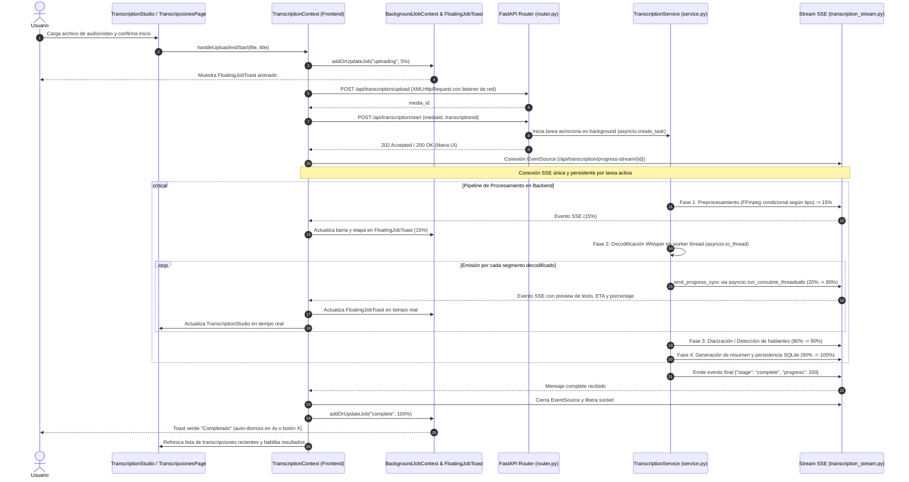

# Arquitectura y Flujo del Proceso de Transcripción

Este documento describe la arquitectura integral y el ciclo de vida del procesamiento de transcripciones de audio y video en la plataforma **QA Management**. El sistema está diseñado para ser **asíncrono, desacoplado, resiliente a micro-cortes y con retroalimentación en tiempo real**.

---

## 1. Diagrama de Secuencia de Extremo a Extremo



---

## 2. Componentes Principales y Responsabilidades

### 2.1. Frontend

* **[`TranscriptionContext.tsx`](file:///c:/Dev/QA_MGMT/frontend/src/features/transcription/context/TranscriptionContext.tsx):**
  * **Propietario del Dominio de Transcripción:** Gobierna el estado de la transcripción seleccionada, subidas en progreso y transcripciones activas.
  * **Conexión SSE Única:** Gestiona de forma centralizada la conexión `EventSource` hacia `/api/transcription/progress-stream/{id}`. Solo existe una conexión SSE por transcripción activa en toda la app.
  * **Polling de Respaldo Adaptativo:** Mantiene un sondeo de contingencia cada 2.5s (`/api/transcription/status/{id}`) que se activa solo cuando hay transcripciones activas y se apaga de inmediato al completarse.
  * **Persistencia:** Almacena y sincroniza el estado de las tareas activas en `localStorage` (`qa_active_transcription_jobs`), permitiendo rehidratar el progreso tras refrescar la página.
  * **Notificación Ascendente:** Empuja actualizaciones a la capa global mediante `addOrUpdateJob`.

* **[`BackgroundJobContext.tsx`](file:///c:/Dev/QA_MGMT/frontend/src/context/BackgroundJobContext.tsx):**
  * **Coordinador Global de Tareas:** Almacena en memoria (`jobsMap`) todas las tareas en segundo plano del sistema (transcripciones y descargas de modelos de IA local).
  * **Ciclo de Vida de UI:** Gestiona los temporizadores de auto-descarte (`dismissTimersRef`), eliminando las notificaciones terminales automáticamente (3s para canceladas, 4s para completadas).
  * **Acciones de Cancelación:** Expone `cancelJob` para canalizar las solicitudes de cancelación tanto al backend como al estado visual del toast.

* **[`FloatingJobToast.tsx`](file:///c:/Dev/QA_MGMT/frontend/src/components/common/FloatingJobToast.tsx):**
  * Componente flotante posicionado en la esquina superior derecha.
  * Muestra iconos contextuales (`Mic` para transcripciones, `Download` para modelos, `CheckCircle2` para éxito, `Ban` para cancelado, `AlertTriangle` para error).
  * Informa porcentaje, ETA, fragmento de texto procesado y botón de cancelación directa ("Cancelar" / "Cancelando...").
  * Permite navegar al hacer clic directo hacia el espacio de trabajo en el estudio de transcripciones.

* **[`TranscriptionStudio.tsx`](file:///c:/Dev/QA_MGMT/frontend/src/features/transcription/components/TranscriptionStudio.tsx):**
  * Espacio de trabajo interactivo que muestra los segmentos transcritos en vivo, identificación de participantes con códigos de color, edición de interlocutores, generación de resúmenes estructurados y guardado en la Base de Conocimiento.

---

### 2.2. Backend

* **[`router.py`](file:///c:/Dev/QA_MGMT/backend/app/features/transcription/router.py):**
  * Expone los endpoints REST para subida (`/upload`), inicio de tarea (`/start`), consulta de estado (`/status/{id}`), cancelación (`/cancel/{id}`) y stream de progreso (`/progress-stream/{id}`).

* **[`service.py`](file:///c:/Dev/QA_MGMT/backend/app/features/transcription/service.py):**
  * Orquesta la ejecución de la tarea en segundo plano mediante `asyncio.create_task`.
  * Ejecuta la decodificación de Whisper dentro de un worker thread con `asyncio.to_thread` para mantener el bucle de eventos de FastAPI responsivo y libre de bloqueos de CPU.

* **[`transcription_stream.py`](file:///c:/Dev/QA_MGMT/backend/app/api/transcription_stream.py):**
  * Hub SSE con colas asíncronas (`asyncio.Queue`) por `transcription_id`.
  * **Seguridad entre hilos (Thread-Safety):** Proporciona `emit_progress_sync()`, que utiliza `asyncio.run_coroutine_threadsafe(emit_progress(...), main_loop)` cuando es invocado desde los hilos de inferencia de Whisper, garantizando que los mensajes se publiquen de forma instantánea y confiable en el bucle principal.
  * Genera pulsos de latido (*heartbeats*) periódicos para prevenir el cierre prematuro de proxies o balanceadores de carga.

---

## 3. Fases Detalladas del Pipeline

| Fase | Rango % | Operación Técnica | Descripción |
| :--- | :---: | :--- | :--- |
| **1. Upload** | `0% - 10%` | HTTP POST multipart con XMLHttpRequest | Transferencia del archivo original (audio o video) al servidor local sin ninguna conversión previa. |
| **2. Preprocessing** | `10% - 20%` | FFmpeg condicional por tipo de archivo | **Archivos de audio nativos** (`.wav`, `.mp3`, `.flac`, `.m4a`, `.ogg`, `.opus`): se pasan directamente a Whisper sin re-codificación. **Archivos de video** (`.mp4`, `.mkv`, `.webm`, `.avi`, `.mov`, etc.) y formatos de audio no soportados (`.wma`, `.aac`, `.oga`): FFmpeg extrae la pista de audio y convierte a `16 kHz mono PCM WAV`. **Cloud (Groq/OpenAI)**: si el archivo supera 20 MB o es WAV/video, FFmpeg comprime a `MP3 48k mono` para cumplir el límite de la API. |
| **3. Transcribing** | `20% - 80%` | Inferencia Whisper (CPU / GPU / API) | Decodificación acústica iterativa. Emite eventos continuos con texto previo, porcentaje y tiempo estimado. |
| **4. Diarizing** | `80% - 90%` | Detección de interlocutores | Agrupación y clasificación de segmentos de audio según la voz de cada hablante detectado. |
| **5. Finalizing** | `90% - 100%` | Guardado y Resumen | Estructuración del documento final, consolidación de metadatos, guardado en archivos JSON locales (`local/transcriptions/`) y emisión de evento `complete`. |

---

## 4. Lógica de Preprocesamiento de Audio

La fase de preprocesamiento aplica una estrategia condicional para evitar re-codificaciones innecesarias:

```
Archivo recibido
│
├── ¿Es formato de audio nativo de Whisper?
│   (.wav, .mp3, .flac, .m4a, .ogg, .opus)
│   └── SÍ → Pasar directamente a Whisper sin conversión  ✓
│
├── ¿Es archivo de video o formato de audio no soportado?
│   (.mp4, .mkv, .webm, .avi, .mov, .wma, .aac, .oga, ...)
│   └── SÍ → FFmpeg: extraer pista de audio → WAV 16 kHz mono PCM
│
└── ¿Modo Cloud (Groq / OpenAI) y tamaño > 20 MB o formato WAV/video?
    └── SÍ → FFmpeg: comprimir → MP3 48k mono (respeta límite 25 MB de la API)
```

**¿Por qué 16 kHz WAV para Whisper local?**
`openai-whisper` computa su espectrograma de Mel internamente a 16 kHz. Alimentarle audio a mayor frecuencia resulta en un re-muestreo interno inmediato. Convertir previamente a 16 kHz elimina ese overhead y garantiza el formato exacto que el modelo espera.

**¿Por qué MP3 48k para cloud?**
Las APIs de Groq y OpenAI imponen un límite de 25 MB por archivo. Un archivo WAV de larga duración puede superarlo fácilmente; comprimir a MP3 48k mono reduce el tamaño entre 8× y 15× con pérdida de calidad imperceptible para voz.

---

## 5. Resiliencia, Concurrencia y Cancelación

### 5.1. Sin Conexiones SSE ni Polling Duplicados
Toda la lógica de suscripción en tiempo real está contenida en `TranscriptionContext`. `BackgroundJobContext` se comporta como un consumidor pasivo que recibe el estado consolidado mediante `addOrUpdateJob`. Esto previene condiciones de carrera, doble consumo de ancho de banda y desincronizaciones visuales.

### 5.2. Recuperación ante Desconexión o Refresco de Pantalla
1. Si el usuario recarga el navegador (`F5`), `TranscriptionContext` lee `qa_active_transcription_jobs` desde `localStorage`.
2. Restablece el estado en memoria y reconecta el `EventSource` al ID activo.
3. El backend continúa la tarea sin interrupción y retoma la emisión de eventos donde se encontraba.

### 5.3. Flujo de Cancelación Limpia
1. El usuario pulsa **"Cancelar"** en el toast o en el estudio.
2. La interfaz cambia inmediatamente a estado transitorio (*"Cancelando transcripción..."*).
3. Se invoca `/api/transcription/cancel/{id}`.
4. El backend marca la tarea como cancelada e interrumpe el proceso de inferencia.
5. El backend emite el evento con `stage: "cancelled"`.
6. El frontend cierra el `EventSource`, marca el estado como `cancelled` y programa el auto-descarte del toast a los 3 segundos.
